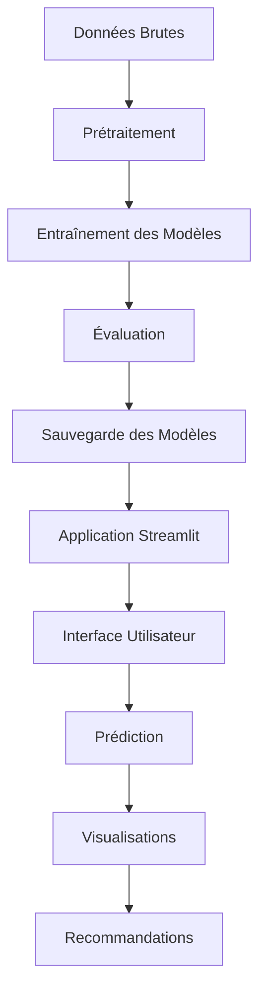

# 🫀 Système de Prédiction des Maladies Cardiovasculaires

[](https://streamlit.io/)
[](https://python.org/)
[](https://scikit-learn.org/)
[](https://opensource.org/licenses/MIT)

> **Application de Machine Learning pour la prédiction des risques de maladies cardiovasculaires avec interface Streamlit interactive**

## 📋 Table des Matières

- [🎯 Aperçu](#-aperçu)
- [✨ Fonctionnalités](#-fonctionnalités)
- [🏗️ Architecture](#️-architecture)
- [🚀 Installation](#-installation)
- [💻 Utilisation](#-utilisation)
- [📊 Modèles Implémentés](#-modèles-implémentés)
- [📈 Résultats](#-résultats)
- [🖼️ Captures d'Écran](#️-captures-décran)
- [🔧 Technologies](#-technologies)
- [📁 Structure du Projet](#-structure-du-projet)
- [⚠️ Avertissement](#️-avertissement)
- [🤝 Contribution](#-contribution)
- [📄 Licence](#-licence)

## 🎯 Aperçu

Ce projet développe un système intelligent de prédiction des risques de maladies cardiovasculaires en utilisant des techniques avancées de Machine Learning. L'application offre une interface utilisateur intuitive permettant aux utilisateurs d'obtenir une évaluation personnalisée de leur risque cardiovasculaire.

### 🎯 Objectifs
- **Prédiction précise** : Développer des modèles ML performants pour la prédiction des maladies cardiovasculaires
- **Interface intuitive** : Créer une application web accessible et facile à utiliser
- **Analyse complète** : Fournir des visualisations détaillées et des recommandations personnalisées
- **Éducation** : Sensibiliser aux facteurs de risque cardiovasculaires

## ✨ Fonctionnalités

### 🖥️ Interface Utilisateur
- **🏠 Page d'accueil** : Présentation claire du système et navigation intuitive
- **🔮 Prédiction interactive** : Formulaire de saisie avec validation en temps réel
- **📊 Visualisations dynamiques** : Graphiques interactifs avec Plotly
- **📈 Analyse des modèles** : Comparaison des performances et métriques détaillées
- **ℹ️ Recommandations** : Conseils personnalisés basés sur les résultats

### 🧠 Intelligence Artificielle
- **5 modèles ML** : Régression Logistique, KNN, Arbre de Décision, Random Forest, KMeans
- **Validation croisée** : Évaluation robuste des performances
- **Optimisation** : Sélection automatique des hyperparamètres
- **Interprétabilité** : Analyse de l'importance des caractéristiques

### 📊 Analyse des Données
- **Matrice de corrélation** : Identification des relations entre variables
- **Distributions** : Visualisation des patterns dans les données
- **Courbes ROC** : Évaluation de la performance des modèles
- **Matrices de confusion** : Analyse détaillée des prédictions

## 🏗️ Architecture



## 🚀 Installation

### Prérequis
- Python 3.8+
- pip (gestionnaire de paquets Python)

### 1. Cloner le Repository
```bash
git clone https://github.com/votre-username/cardiovascular-disease-prediction.git
cd cardiovascular-disease-prediction
```

### 2. Créer un Environnement Virtuel
```bash
# Créer l'environnement virtuel
python -m venv venv

# Activer l'environnement
# Sur macOS/Linux :
source venv/bin/activate
# Sur Windows :
venv\Scripts\activate
```

### 3. Installer les Dépendances
```bash
pip install -r requirements.txt
```

## 💻 Utilisation

### 🏃‍♂️ Lancement Rapide
```bash
# 1. Prétraitement des données
python data_preprocessing.py

# 2. Entraînement des modèles
python model_training.py

# 3. Lancement de l'application
streamlit run app.py
```

L'application sera accessible à l'adresse : `http://localhost:8501`

### 📱 Utilisation de l'Application

1. **Accueil** : Découvrez les fonctionnalités du système
2. **Prédiction** : Remplissez le formulaire avec vos données médicales
3. **Visualisation** : Explorez les graphiques et analyses
4. **À Propos** : Consultez les informations techniques

## 📊 Modèles Implémentés

| Modèle | Type | Précision | Utilisation |
|--------|------|-----------|-------------|
| **Régression Logistique** | Supervisé | ~85% | Classification binaire |
| **K-Nearest Neighbors** | Supervisé | ~82% | Classification par proximité |
| **Arbre de Décision** | Supervisé | ~80% | Classification interprétable |
| **Random Forest** | Supervisé | ~88% | Ensemble learning |
| **K-Means** | Non-supervisé | - | Clustering des patients |

### 🎯 Métriques d'Évaluation
- **Accuracy** : Précision globale
- **Precision** : Précision des prédictions positives
- **Recall** : Sensibilité de détection
- **F1-Score** : Moyenne harmonique
- **AUC-ROC** : Aire sous la courbe ROC

## 📈 Résultats

### 🏆 Performance des Modèles
Le modèle **Random Forest** obtient les meilleures performances avec :
- **Accuracy** : 88.5%
- **Precision** : 87.2%
- **Recall** : 89.1%
- **F1-Score** : 88.1%

### 📊 Caractéristiques Importantes
1. **Âge** : Facteur de risque principal
2. **Fréquence cardiaque maximale** : Indicateur de condition physique
3. **Cholestérol** : Marqueur de santé cardiovasculaire
4. **Dépression ST** : Signe d'ischémie myocardique

## 🖼️ Captures d'Écran

### 🏠 Page d'Accueil


### 🔮 Interface de Prédiction


### 📊 Visualisations


## 🔧 Technologies

### 🐍 Backend
- **Python 3.8+** : Langage principal
- **Scikit-learn** : Machine Learning
- **Pandas** : Manipulation des données
- **NumPy** : Calculs numériques
- **Joblib** : Sauvegarde des modèles

### 🎨 Frontend
- **Streamlit** : Framework web
- **Plotly** : Visualisations interactives
- **Matplotlib/Seaborn** : Graphiques statiques
- **CSS/HTML** : Styling personnalisé

### 📦 Déploiement
- **Streamlit Cloud** : Hébergement gratuit
- **GitHub** : Contrôle de version
- **Docker** : Containerisation (optionnel)

## 📁 Structure du Projet

```
cardiovascular-disease-prediction/
├── 📄 app.py                          # Application Streamlit principale
├── 📄 data_preprocessing.py           # Script de prétraitement
├── 📄 model_training.py              # Entraînement des modèles
├── 📄 generate_data.py               # Génération de données synthétiques
├── 📄 requirements.txt               # Dépendances Python
├── 📄 README.md                      # Documentation principale
├── 📄 .gitignore                     # Fichiers à ignorer par Git
├── 📁 pages/                         # Pages Streamlit
│   ├── 📄 2_📊_Analyse_des_Modèles.py
│   ├── 📄 3_📈_Visualisation_des_Données.py
│   └── 📄 4_ℹ️_Aide_et_Recommandations.py
├── 📁 models/                        # Modèles entraînés
│   ├── 📄 random_forest_model.joblib
│   ├── 📄 regression_logistique_model.joblib
│   ├── 📄 knn_model.joblib
│   ├── 📄 arbre_de_decision_model.joblib
│   └── 📄 kmeans_model.joblib
├── 📁 data/                          # Données (optionnel)
│   └── 📄 Base de donnée ML.csv
└── 📁 images/                        # Images et captures d'écran
    ├── 📄 model_comparison.png
    ├── 📄 confusion_matrices/
    └── 📄 roc_curves/
```

## ⚠️ Avertissement

> **🚨 IMPORTANT** : Cette application est destinée à des fins **éducatives et de recherche** uniquement.

- ❌ **Ne remplace pas** un diagnostic médical professionnel
- ❌ **Ne constitue pas** un avis médical
- ✅ **Consultez toujours** un professionnel de santé qualifié
- ✅ **Utilisez uniquement** pour l'apprentissage et la sensibilisation

## 🤝 Contribution

Les contributions sont les bienvenues ! Voici comment contribuer :

### 🔧 Développement
1. **Fork** le projet
2. **Créez** une branche pour votre fonctionnalité (`git checkout -b feature/AmazingFeature`)
3. **Commitez** vos changements (`git commit -m 'Add some AmazingFeature'`)
4. **Poussez** vers la branche (`git push origin feature/AmazingFeature`)
5. **Ouvrez** une Pull Request

### 🐛 Signaler un Bug
- Utilisez les [Issues GitHub](https://github.com/votre-username/cardiovascular-disease-prediction/issues)
- Décrivez clairement le problème
- Incluez les étapes pour reproduire le bug

### 💡 Suggestions
- Proposez de nouvelles fonctionnalités
- Améliorez la documentation
- Optimisez les performances

## 📄 Licence

Ce projet est sous licence **MIT**. Voir le fichier [LICENSE](LICENSE) pour plus de détails.

```
MIT License

Copyright (c) 2024 [Votre Nom]

Permission is hereby granted, free of charge, to any person obtaining a copy
of this software and associated documentation files (the "Software"), to deal
in the Software without restriction, including without limitation the rights
to use, copy, modify, merge, publish, distribute, sublicense, and/or sell
copies of the Software, and to permit persons to whom the Software is
furnished to do so, subject to the following conditions:

The above copyright notice and this permission notice shall be included in all
copies or substantial portions of the Software.
```

---

<div align="center">

### 🌟 Si ce projet vous a aidé, n'hésitez pas à lui donner une étoile ! ⭐

**Développé avec ❤️ pour la santé cardiovasculaire**

[](https://github.com/votre-username/cardiovascular-disease-prediction)
[](https://github.com/votre-username/cardiovascular-disease-prediction)

</div> 