# 🫀 Système de Prédiction des Maladies Cardiovasculaires

[](https://cardiovascular-disease-prediction-ajmznkpqhaewp2xwdmhcgc.streamlit.app/)

> Démo en ligne: https://cardiovascular-disease-prediction-ajmznkpqhaewp2xwdmhcgc.streamlit.app/

[](https://streamlit.io/)
[](https://python.org/)
[](https://scikit-learn.org/)
[](https://opensource.org/licenses/MIT)

> **Application de Machine Learning pour la prédiction des risques de maladies cardiovasculaires avec interface Streamlit interactive**

## 📋 Table des Matières

- [🎯 Aperçu](#-aperçu)
- [✨ Fonctionnalités](#-fonctionnalités)
- [🏗️ Architecture](#️-architecture)
- [🚀 Installation](#-installation)
- [💻 Utilisation](#-utilisation)
- [📊 Modèles Implémentés](#-modèles-implémentés)
- [📈 Résultats](#-résultats)
- [🖼️ Captures d'Écran](#️-captures-décran)
- [🔧 Technologies](#-technologies)
- [📁 Structure du Projet](#-structure-du-projet)
- [⚠️ Avertissement](#️-avertissement)
- [🤝 Contribution](#-contribution)
- [📄 Licence](#-licence)

## 🎯 Aperçu

Ce projet développe un système intelligent de prédiction des risques de maladies cardiovasculaires en utilisant des techniques avancées de Machine Learning. L'application offre une interface utilisateur intuitive permettant aux utilisateurs d'obtenir une évaluation personnalisée de leur risque cardiovasculaire.

### 🚀 Démonstration en Direct

> **🎬 Application Interactive** : [Lancer la démonstration](http://localhost:8501) *(disponible localement)*
> 
> **📱 Interface Mobile-Friendly** : Design responsive adapté à tous les écrans
> 
> **⚡ Prédiction en Temps Réel** : Résultats instantanés avec recommandations personnalisées

### 🎯 Objectifs
- **Prédiction précise** : Développer des modèles ML performants pour la prédiction des maladies cardiovasculaires
- **Interface intuitive** : Créer une application web accessible et facile à utiliser
- **Analyse complète** : Fournir des visualisations détaillées et des recommandations personnalisées
- **Éducation** : Sensibiliser aux facteurs de risque cardiovasculaires

## ✨ Fonctionnalités

### 🖥️ Interface Utilisateur
- **🏠 Page d'accueil** : Présentation claire du système et navigation intuitive
- **🔮 Prédiction interactive** : Formulaire de saisie avec validation en temps réel
- **📊 Visualisations dynamiques** : Graphiques interactifs avec Plotly
- **📈 Analyse des modèles** : Comparaison des performances et métriques détaillées
- **ℹ️ Recommandations** : Conseils personnalisés basés sur les résultats

### 🧠 Intelligence Artificielle
- **5 modèles ML** : Régression Logistique, KNN, Arbre de Décision, Random Forest, KMeans
- **Validation croisée** : Évaluation robuste des performances
- **Optimisation** : Sélection automatique des hyperparamètres
- **Interprétabilité** : Analyse de l'importance des caractéristiques

### 📊 Analyse des Données
- **Matrice de corrélation** : Identification des relations entre variables
- **Distributions** : Visualisation des patterns dans les données
- **Courbes ROC** : Évaluation de la performance des modèles
- **Matrices de confusion** : Analyse détaillée des prédictions

## 🏗️ Architecture

```mermaid
graph TD
    A[Données Brutes] --> B[Prétraitement]
    B --> C[Entraînement des Modèles]
    C --> D[Évaluation]
    D --> E[Sauvegarde des Modèles]
    E --> F[Application Streamlit]
    F --> G[Interface Utilisateur]
    G --> H[Prédiction]
    H --> I[Visualisations]
    I --> J[Recommandations]
```



## 🚀 Installation

### Prérequis
- Python 3.8+
- pip (gestionnaire de paquets Python)

### 1. Cloner le Repository
```bash
git clone https://github.com/votre-username/cardiovascular-disease-prediction.git
cd cardiovascular-disease-prediction
```

### 2. Créer un Environnement Virtuel
```bash
# Créer l'environnement virtuel
python -m venv venv

# Activer l'environnement
# Sur macOS/Linux :
source venv/bin/activate
# Sur Windows :
venv\Scripts\activate
```

### 3. Installer les Dépendances
```bash
pip install -r requirements.txt
```

## 💻 Utilisation

### 🏃‍♂️ Lancement Rapide
```bash
# 1. Prétraitement des données
python data_preprocessing.py

# 2. Entraînement des modèles
python model_training.py

# 3. Lancement de l'application
streamlit run app.py
```

L'application sera accessible à l'adresse : `http://localhost:8501`

### 📱 Utilisation de l'Application

1. **Accueil** : Découvrez les fonctionnalités du système
2. **Prédiction** : Remplissez le formulaire avec vos données médicales
3. **Visualisation** : Explorez les graphiques et analyses
4. **À Propos** : Consultez les informations techniques

## 📊 Modèles Implémentés

| Modèle | Type | Précision | Utilisation |
|--------|------|-----------|-------------|
| **Régression Logistique** | Supervisé | ~85% | Classification binaire |
| **K-Nearest Neighbors** | Supervisé | ~82% | Classification par proximité |
| **Arbre de Décision** | Supervisé | ~80% | Classification interprétable |
| **Random Forest** | Supervisé | ~88% | Ensemble learning |
| **K-Means** | Non-supervisé | - | Clustering des patients |

### 🎯 Métriques d'Évaluation
- **Accuracy** : Précision globale
- **Precision** : Précision des prédictions positives
- **Recall** : Sensibilité de détection
- **F1-Score** : Moyenne harmonique
- **AUC-ROC** : Aire sous la courbe ROC

## 📈 Résultats et Performances

### 🏆 Métriques Clés du Projet

| Métrique | Valeur | Description |
|----------|--------|-------------|
| **📊 Dataset** | 12,310 observations | Base de données complète et équilibrée |
| **🎯 Variables** | 12 caractéristiques | Paramètres cliniques essentiels |
| **🧠 Modèles ML** | 5 algorithmes | Comparaison multi-modèles |
| **⚡ Prédiction** | < 1 seconde | Temps de réponse instantané |
| **📱 Interface** | 100% responsive | Compatible mobile et desktop |

### 🏆 Performance des Modèles
Le modèle **Régression Logistique** obtient les meilleures performances avec :
- **Accuracy** : **87.0%** 🎯
- **Precision** : **86.8%** 🎯
- **Recall** : **90.1%** 🎯
- **F1-Score** : **88.4%** 🎯

### 📊 Caractéristiques Importantes Identifiées
1. **Douleur Thoracique (cp)** : Variable la plus prédictive
2. **Angine d'Effort (exang)** : Indicateur de stress cardiaque
3. **Dépression ST (oldpeak)** : Signe d'ischémie myocardique
4. **Âge** : Facteur de risque progressif
5. **Sexe** : Différences de prédisposition

### 🎯 Insights Découverts
- **Distribution Équilibrée** : 52.8% avec maladie, 47.2% sans maladie
- **Risque Multifactoriel** : Aucune variable dominante unique
- **Variables Indépendantes** : Faible corrélation entre caractéristiques
- **Optimisation ML** : Structure favorable pour l'apprentissage

## 🖼️ Démonstration Interactive

### 🏠 Page d'Accueil - Présentation du Système
<div align="center">
  
  <p><em>Interface d'accueil avec navigation intuitive et présentation des fonctionnalités clés</em></p>
</div>

**✨ Fonctionnalités Mises en Valeur :**
- **Évaluation Rapide** : Interface simple pour l'évaluation du risque
- **Analyse Détaillée** : Visualisations avancées des indicateurs de santé  
- **Conseils Personnalisés** : Recommandations adaptées au profil utilisateur
- **Processus en 3 étapes** : Guide clair pour l'utilisation

---

### 🔮 Interface de Prédiction - Fonctionnalité Principale
<div align="center">
  
  <p><em>Formulaire interactif avec résultats en temps réel et recommandations personnalisées</em></p>
</div>

**🎯 Capacités Démonstrées :**
- **Formulaire Médical Complet** : 11 paramètres cliniques essentiels
- **Prédiction Instantanée** : Résultats avec probabilité de risque (3% dans cet exemple)
- **Recommandations Intelligentes** : Conseils adaptés au niveau de risque
- **Interface Utilisateur** : Design professionnel et accessible

---

### 📊 Exploration Avancée des Données - Compétences EDA
<div align="center">
  
  <p><em>Analyse exploratoire complète avec statistiques descriptives et distribution des classes</em></p>
</div>

**📈 Analyses Incluses :**
- **Aperçu des Données** : 12,310 observations, 12 variables
- **Statistiques Descriptives** : Moyennes, médianes, écarts-types
- **Distribution Équilibrée** : 5,871 cas sans maladie / 6,439 cas avec maladie
- **Interprétation Automatique** : Insights générés automatiquement

---

### 🔍 Matrice de Corrélation - Analyse des Relations
<div align="center">
  
  <p><em>Heatmap interactive révélant les relations entre les variables médicales</em></p>
</div>

**🧠 Insights Clés :**
- **Variables Indépendantes** : Faible corrélation entre les caractéristiques
- **Risque Multifactoriel** : Aucune variable dominante pour la prédiction
- **Optimisation ML** : Structure favorable pour l'apprentissage automatique
- **Interprétation Intelligente** : Explications automatiques des patterns

---

### 🎯 **Fonctionnalités Complètes de l'Application**

**📊 Analyse des Relations avec la Variable Cible :**
- **Distribution des Classes** : 52.8% avec maladie, 47.2% sans maladie
- **Variables Clés** : `cp` (douleur thoracique) et `exang` (angine d'effort) les plus corrélées
- **Analyse par Âge** : Distribution similaire entre les groupes (médiane ~54 ans)
- **Statistiques Comparatives** : Analyse détaillée par classe de maladie

**🧠 Performance des Modèles - Expertise Machine Learning :**
- **Régression Logistique** : 87% accuracy, 86.8% precision, 90.1% recall
- **Comparaison Multi-Modèles** : 5 algorithmes évalués simultanément
- **Métriques Complètes** : Accuracy, Precision, Recall, F1-Score
- **Interprétation Automatique** : Explications claires des performances

**📚 Documentation et Aide - Professionnalisme :**
- **Guide d'Utilisation** : Instructions étape par étape
- **Interprétation des Résultats** : Guide pour comprendre les prédictions
- **Navigation Intuitive** : Structure claire et accessible
- **Support Utilisateur** : FAQ et recommandations générales

**🔧 Stack Technologique Complet :**
- **Backend** : Python, Scikit-learn, Pandas, NumPy
- **Frontend** : Streamlit, Plotly, Matplotlib/Seaborn
- **Modèles ML** : 5 algorithmes (Logistic Regression, KNN, Decision Tree, Random Forest, KMeans)
- **Déploiement** : Application web accessible et responsive

## 🔧 Technologies

### 🐍 Backend
- **Python 3.8+** : Langage principal
- **Scikit-learn** : Machine Learning
- **Pandas** : Manipulation des données
- **NumPy** : Calculs numériques
- **Joblib** : Sauvegarde des modèles

### 🎨 Frontend
- **Streamlit** : Framework web
- **Plotly** : Visualisations interactives
- **Matplotlib/Seaborn** : Graphiques statiques
- **CSS/HTML** : Styling personnalisé

### 📦 Déploiement
- **Streamlit Cloud** : Hébergement gratuit
- **GitHub** : Contrôle de version
- **Docker** : Containerisation (optionnel)

## 📁 Structure du Projet

```
cardiovascular-disease-prediction/
├── 📄 app.py                          # Application Streamlit principale
├── 📄 data_preprocessing.py           # Script de prétraitement
├── 📄 model_training.py              # Entraînement des modèles
├── 📄 generate_data.py               # Génération de données synthétiques
├── 📄 requirements.txt               # Dépendances Python
├── 📄 README.md                      # Documentation principale
├── 📄 .gitignore                     # Fichiers à ignorer par Git
├── 📁 pages/                         # Pages Streamlit
│   ├── 📄 2_📊_Analyse_des_Modèles.py
│   ├── 📄 3_📈_Visualisation_des_Données.py
│   └── 📄 4_ℹ️_Aide_et_Recommandations.py
├── 📁 models/                        # Modèles entraînés
│   ├── 📄 random_forest_model.joblib
│   ├── 📄 regression_logistique_model.joblib
│   ├── 📄 knn_model.joblib
│   ├── 📄 arbre_de_decision_model.joblib
│   └── 📄 kmeans_model.joblib
├── 📁 data/                          # Données (optionnel)
│   └── 📄 Base de donnée ML.csv
└── 📁 images/                        # Images et captures d'écran
    ├── 📄 model_comparison.png
    ├── 📄 confusion_matrices/
    └── 📄 roc_curves/
```

## ⚠️ Avertissement

> **🚨 IMPORTANT** : Cette application est destinée à des fins **éducatives et de recherche** uniquement.

- ❌ **Ne remplace pas** un diagnostic médical professionnel
- ❌ **Ne constitue pas** un avis médical
- ✅ **Consultez toujours** un professionnel de santé qualifié
- ✅ **Utilisez uniquement** pour l'apprentissage et la sensibilisation

## 🤝 Contribution

Les contributions sont les bienvenues ! Voici comment contribuer :

### 🔧 Développement
1. **Fork** le projet
2. **Créez** une branche pour votre fonctionnalité (`git checkout -b feature/AmazingFeature`)
3. **Commitez** vos changements (`git commit -m 'Add some AmazingFeature'`)
4. **Poussez** vers la branche (`git push origin feature/AmazingFeature`)
5. **Ouvrez** une Pull Request

### 🐛 Signaler un Bug
- Utilisez les [Issues GitHub](https://github.com/votre-username/cardiovascular-disease-prediction/issues)
- Décrivez clairement le problème
- Incluez les étapes pour reproduire le bug

### 💡 Suggestions
- Proposez de nouvelles fonctionnalités
- Améliorez la documentation
- Optimisez les performances

## 📄 Licence

Ce projet est sous licence **MIT**. Voir le fichier [LICENSE](LICENSE) pour plus de détails.

```
MIT License

Copyright (c) 2024 [Votre Nom]

Permission is hereby granted, free of charge, to any person obtaining a copy
of this software and associated documentation files (the "Software"), to deal
in the Software without restriction, including without limitation the rights
to use, copy, modify, merge, publish, distribute, sublicense, and/or sell
copies of the Software, and to permit persons to whom the Software is
furnished to do so, subject to the following conditions:

The above copyright notice and this permission notice shall be included in all
copies or substantial portions of the Software.
```

---

<div align="center">

### 🌟 Si ce projet vous a aidé, n'hésitez pas à lui donner une étoile ! ⭐

**Développé avec ❤️ pour la santé cardiovasculaire**

[](https://github.com/votre-username/cardiovascular-disease-prediction)
[](https://github.com/votre-username/cardiovascular-disease-prediction)

</div> 